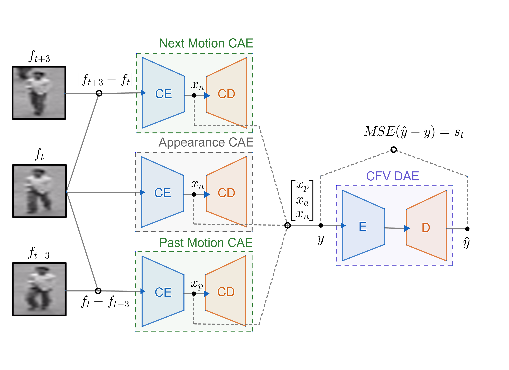

# Anomaly detection in videos
This repository contains source code for our AI course project about frame-level anomaly detection in videos.

## Files
- oneclasssvm.ipynb : contains low level method based on HOG and One Class SVM.
- utilities.py : contains all the utilities for our version of the Object-centric autoencoder method.
- networks.py : contains the implementations of all the auto-encoders.
- train_model_v1.py : contains the training script of the auto-encoders.
- detect_anomalies_v1.py : contains the testing script (inference mode) of the Object-centric autoencoder method.

## Requirements
- [retinanet](https://github.com/fizyr/keras-retinanet)
- matplotlib 3.0.2
- seaborn 0.9.0
- opencv 3.4.2
- tensorflow 1.12.0
- scikit-image 0.14.2
- scikit-learn 0.20.3
- pandas 0.24.2

We installed retinanet from source and the rest of the packages with conda.

## Contact
- mehdi.miah@gmail.com 
- pankaj.raj.roy@gmail.com
- jules.simon@polymtl.ca
- kang.zhuofei@gmail.com
- zahra.sedaghat@polymtl.ca
